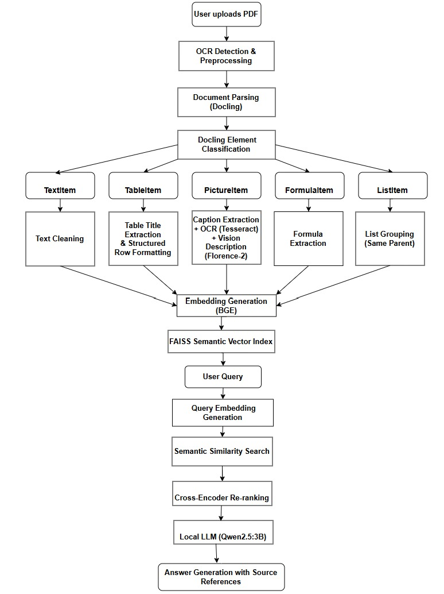

# MultiModal_RAG

# Overview
This project presents a MultiModal Retrieval-Augmented Generation (RAG) system designed to extract, index, and retrieve information from PDF documents. Unlike conventional RAG pipelines that primarily focus on plain text, this system leverages Docling to understand the structural components of a document and process multiple content types, including text, tables, images, formulas, and lists.

The ingestion pipeline converts each document element into semantically meaningful chunks enriched with contextual metadata such as section names, page numbers, document names, and content types. These chunks are embedded using the BAAI/bge-base-en-v1.5 embedding model and indexed in FAISS for efficient semantic retrieval. Retrieved candidates are further refined using a Cross-Encoder reranker, while table-specific retrieval dynamically identifies the most relevant row before generating the final response using a local LLM.

The system also incorporates several reliability enhancements, including automatic OCR detection, batch processing for large documents, missing page recovery, duplicate chunk prevention, and caption filtering, making it robust for processing large and complex PDF documents.

# Features
Intelligent PDF parsing using Docling
Text extraction with section-aware chunking
Structured table extraction with row-level retrieval
Image understanding using Tesseract OCR and Florence-2 Vision Model
Formula extraction
Context-preserving list grouping
Semantic retrieval using FAISS
Cross-Encoder re-ranking for improved relevance
Retrieval across all documents or selected documents
Batch ingestion for large PDFs
Automatic missing page recovery
Duplicate chunk prevention
Modern web-based interface for document upload and querying

## System Architecture

  

